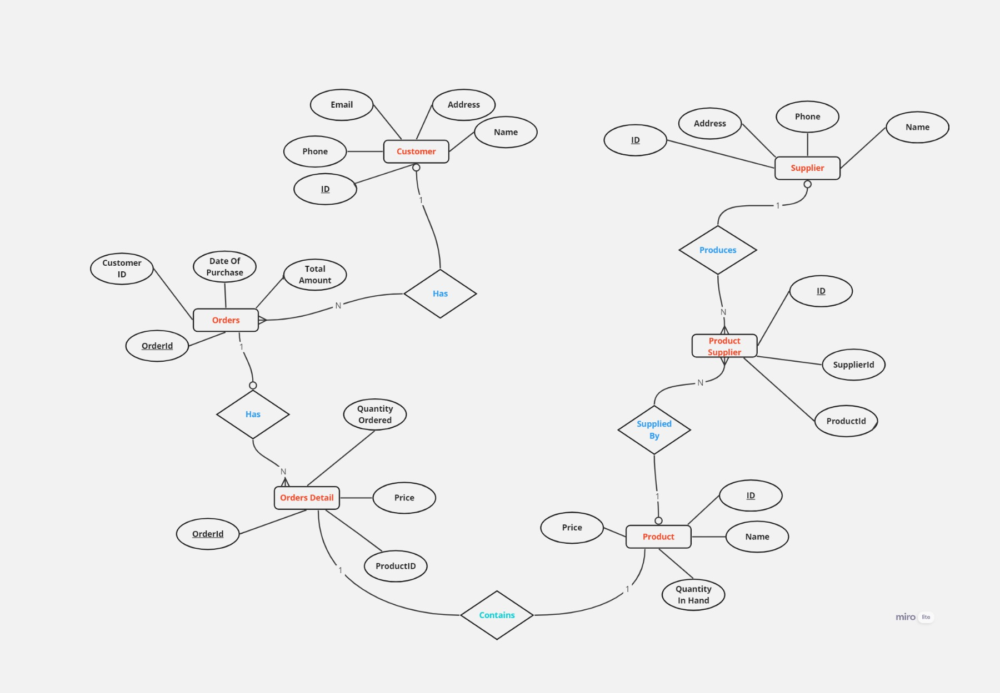

# Database Design and ER Modelling 

## Topics Covered

* SQL

* ERD Diagram

* Entity

* Attributes

* Outer Join

## Tasks

###  1. Database Design for a Shop

Design a database for a shop that sells products. The database should consider the following points:

* A shop want to record the stock available and billed in a shop.

* Customer data has to be minimum.

* One product could be supplied by multiple supplier.

* A Single supplier can supply many products.

### ERD Design

**Customer** - Id(pk), Name, Phone, Email

**Product** - Id(pk), Name, Price, QuantityInHand

**SupplierMaster** - Id(pk), Name, Phone

**ProductSupplier** - Id(pk), ProductId(fk), SupplierId(fk)

**Order** - OrderId, ProductId, QuantityOrdered, Price

**OrderMaster** - OrderId,customerId, Date of Order, TotalAmount.

### ER Diagram

### 2. Database Design for a Movie Rental Shop

Create an ER model for a movie store with the following specifications:

* A video store rents movies to members.
* Each movie in the store has a title and is identified by a unique movie number.
* A movie can be in VHS, VCD, or DVD format.
* Each movie belongs to one of a given set of categories (action, adventure, comedy, etc.)
* The store has a name and a unique phone number for each member.
* Each member may provide a favorite movie category (used for marketing purposes).
* There are two types of members: Golden Members and Bronze Members.
* Golden Members can rent one or more movies using their credit cards, while Bronze Members can rent a maximum of one movie.
* A member may have a number of dependents (with known names), each of whom is allowed to rent one movie at a time.

### ERD Design

**Member** : Id (Primary Key), Name, Phone, Favorite Category

**Movie** : Id (Primary Key), Title, Format (VHS, VCD, DVD), CategoryID (Foreign Key)

**Category** : Id (Primary Key), Category Name

**Rental** : Id (Primary Key), MemberID (Foreign Key), RentalDate, ReturnDate

**Rental Details** : RentalId (Foreign Key), MovieId (Foreign Key)

**Dependents** : Id (Primary Key), MemberID (Foreign Key)

### ER Diagram

## SQL QUeries

Worked on Outer join queries in SQL. The file for the same can be found [here](./OuterJoinQueries.sql)
