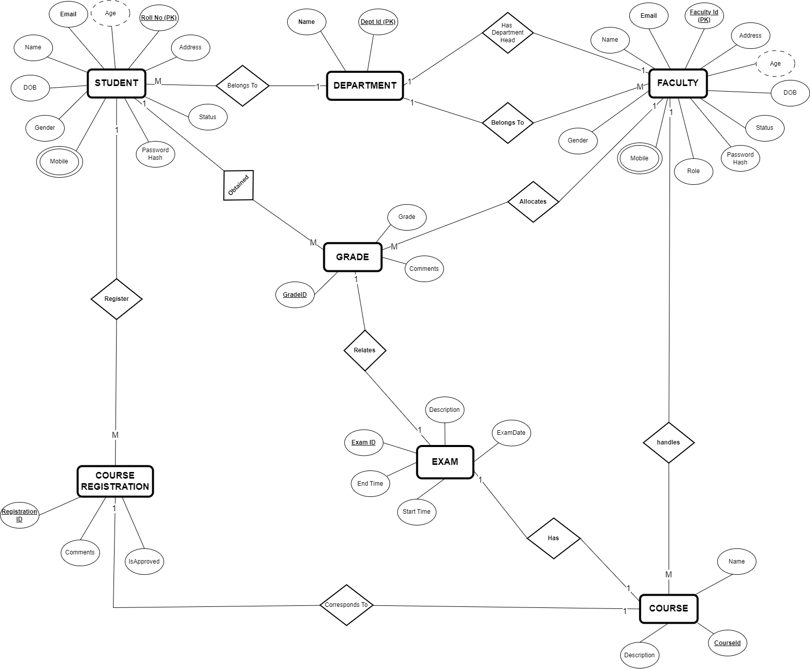

# Day 29

## Topics Covered

- UNIT TESTING

- VALIDATIONS

- PROJECT

## Work

- Worked on Unit Testing in Employee Request Tracker Application

- Worked on Validations in Employee Request Tracker Application

  You can find the repo link [here](../Day24/EmployeeRequestTrackerSolution)

- Worked on ERD for the Backend Mini Project - Student Management System

  You can also find the ERD [here](./ERD.png)
  
  

## TABLES

### 1. Student 

- Student Roll No (pk)
- Email (unique)
- Name
- DOB
- Age
- Gender
- Mobile
- Address
- Password Hash Key
- Hashed Password
- Status
- Department Id (fk)

### 2. Faculty

- Faculty Id (pk)
- Name 
- Gender
- Age
- DOB
- Mobile
- Address
- Email (unique)
- Password Hash Key
- Hashed Password
- Status
- Role (Admin, faculty)
- Department Id (fk)

### 3. Department

- Dept Id (pk)
- Name (unique)
- Head Id (fk)

### 4. Course Id (pk)

- Name (unique)
- Description 
- Faculty Id (fk)

### 5. Course Registration

- Registration ID
- Student ID
- Course ID
- Is Approved
- Comments

### 6. Grade

- Id (PK)
- Student Id (FK)
- Exam Id (FK)
- Evaluated By (FK)
- Marks Scored
- Percentage
- Grade ('O', 'A', 'B', 'C', 'F')
- Comments

### 7. Exam

- Exam Id (PK)
- Course Id (FK) (unique)
- Total Mark
- Exam Date
- Exam Type (online or offline)
- Start Time
- End Time

### 8. Student Attendance

- ID (pk)
- Student Roll No (fk)
- Course ID (fk)
- Date
- Attendance Status (Present, Absent, OD)

## END POINTS

### Student Endpoints

1. **Register a new student**
   - **POST** `/api/students/register`
   - **Description**: Registers a new student with status set to "Inactive".

1. **Login as a Student**
   - **POST** `/api/students/login`
   - **Description**: Logins to the application if his/her account is activated.

2. **Update student details**
   - **PUT** `/api/students/{id}`
   - **Description**: Allows students to update their basic details.

4. **Delete a student**
   - **DELETE** `/api/students/{id}`
   - **Description**: Admin deletes a student from the system.
   - **Accessibility** - Only Admin can access

5. **View student information by ID**
   - **GET** `/api/students/{id}`
   - **Description**: Retrieves the information of a current Logged in student.

6. **View student information by Name**
   - **GET** `/api/students/get-student-by-name?name={name}`
   - **Description**: Retrieves the information of a current Logged in student.

7. **View student information by Email**
   - **GET** `/api/students/get-student-by-email?email={name}`
   - **Description**: Retrieves the information of a current Logged in student.

8. **View all students**
   - **GET** `/api/students`
   - **Description**: Retrieves a list of all students.
   - **Accessibility** - Only Admin can access

9. **Get students by department**
    - **GET** `/api/students/get-students-by-department?departmentId={departmentId}`
    - **Description**: Retrieves a list of all faculty members in a specific department.
    - **Accessibility** - Only Admin, Heads Of Department can access

 
### Faculty Endpoints

1. **Register a new faculty**
   - **POST** `/api/faculty/register`
   - **Description**: Registers a new faculty member with status set to "Inactive".
   - **Accessibility** - Only Admin can access

2. **Login as a Faculty**
   - **POST** `/api/faculty/login`
   - **Description**: Logs in to the application if the account is activated.

3. **Update faculty details**
   - **PUT** `/api/faculty/{id}`
   - **Description**: Allows faculty members to update their basic details.

4. **Delete a faculty**
   - **DELETE** `/api/faculty/{id}`
   - **Description**: Admin deletes a faculty member from the system.
   - **Accessibility** - Only Admin can access

5. **View faculty information by ID**
   - **GET** `/api/faculty/{id}`
   - **Description**: Retrieves the information of a specific faculty member by ID.

6. **View faculty information by Name**
   - **GET** `/api/faculty?name={name}`
   - **Description**: Retrieves the information of a faculty member by name.

7. **View faculty information by Email**
   - **GET** `/api/faculty?email={email}`
   - **Description**: Retrieves the information of a faculty member by email.

8. **View all faculty**
   - **GET** `/api/faculty`
   - **Description**: Retrieves a list of all faculty members.
   - **Accessibility** - Only Admin can access

9. **Get professors**
   - **GET** `/api/faculty/professors`
   - **Description**: Retrieves a list of all faculty members with the role of Professor.
   - **Accessibility** - Only Admin can access

10. **Get associate professors**
    - **GET** `/api/faculty/associate-professors`
    - **Description**: Retrieves a list of all faculty members with the role of Associate Professor.
    - **Accessibility** - Only Admin can access

11. **Get assistant professors**
    - **GET** `/api/faculty/assistant-professors`
    - **Description**: Retrieves a list of all faculty members with the role of Assistant Professor.
    - **Accessibility** - Only Admin can access

12. **Get heads of department**
    - **GET** `/api/faculty/heads-of-department`
    - **Description**: Retrieves a list of all faculty members with the role of Head of Department.
    - **Accessibility** - Only Admin can access

13. **Get faculty by department**
    - **GET** `/api/faculty/get-faculties-by-department?departmentId={departmentId}`
    - **Description**: Retrieves a list of all faculty members in a specific department.
    - **Accessibility** - Only Admin, Heads Of Department can access

### Department Endpoints

1. **Create a new department**
   - **POST** `/api/departments`
   - **Description**: Creates a new department.
   - **Accessibility**: Only Admin can access

2. **Get all departments**
   - **GET** `/api/departments`
   - **Description**: Retrieves a list of all departments.

3. **Get department by ID**
   - **GET** `/api/departments/{id}`
   - **Description**: Retrieves details of a specific department by its ID.

4. **Update a department**
   - **PUT** `/api/departments/{id}`
   - **Description**: Updates the details of an existing department.
   - **Accessibility**: Only Admin can access

5. **Delete a department**
   - **DELETE** `/api/departments/{id}`
   - **Description**: Deletes a department from the system.
   - **Accessibility**: Only Admin can access

### Course Endpoints

1. **Create a new course**
   - **POST** `/api/courses`
   - **Description**: Creates a new course.
   - **Accessibility**: Only Admin can access

2. **Get all courses**
   - **GET** `/api/courses`
   - **Description**: Retrieves a list of all courses.
   - **Accessibility**: Admin, Faculty, and Students can access

3. **Get course by ID**
   - **GET** `/api/courses/{id}`
   - **Description**: Retrieves details of a specific course by its ID.
   - **Accessibility**: Admin, Faculty, and Students can access

4. **Update a course**
   - **PUT** `/api/courses/{id}`
   - **Description**: Updates the details of an existing course.
   - **Accessibility**: Only Admin can access

5. **Delete a course**
   - **DELETE** `/api/courses/{id}`
   - **Description**: Deletes a course from the system.
   - **Accessibility**: Only Admin can access

6. **Get courses by faculty**
   - **GET** `/api/courses/get-course-by-faculty?facultyId={facultyId}`
   - **Description**: Retrieves a list of courses taught by a specific faculty member.
   - **Accessibility**: Admin, Faculty, and Students can access

7. **Get course by name**
   - **GET** `/api/courses/{name}`
   - **Description**: Retrieves details of a specific course by its name.
   - **Accessibility**: Admin, Faculty, and Students can access

### Course Registration Endpoints

1. **Create a new course registration**
   - **POST** `/api/course-registration`
   - **Description**: Registers a student for a course.
   - **Accessibility**: Admin, Faculty, and Students can access

2. **Get all course registrations**
   - **GET** `/api/course-registration`
   - **Description**: Retrieves a list of all course registrations.
   - **Accessibility**: Admin, Faculty, and Students can access

3. **Get course registration by ID**
   - **GET** `/api/course-registration/{id}`
   - **Description**: Retrieves details of a specific course registration by its ID.
   - **Accessibility**: Admin, Faculty, and Students can access

4. **Update course registration**
   - **PUT** `/api/course-registration/{id}`
   - **Description**: Updates the details of an existing course registration.
   - **Accessibility**: Admin, Faculty, and Students can access

5. **Delete course registration**
   - **DELETE** `/api/course-registration/{id}`
   - **Description**: Deletes a course registration from the system.
   - **Accessibility**: Admin, Faculty, and Students can access

6. **Get courses registered by a student**
   - **GET** `/api/course-registration/get-courses?studentId={id}`
   - **Description**: Retrieves a list of courses registered by a specific student.
   - **Accessibility**: Admin, Faculty, and Students can access

7. **Get students registered in a course**
   - **GET** `/api/course-registration/get-students?courseId={id}`
   - **Description**: Retrieves a list of students registered in a specific course.
   - **Accessibility**: Admin, Faculty, and Students can access

8. **Approve course registration by ID**
   - **PUT** `/api/course-registration/approve/{id}`
   - **Description**: Approves a specific course registration by its ID.
   - **Accessibility**: Only Admin can access

9. **Approve all course registrations for a student**
   - **PUT** `/api/course-registration/approve/student/{id}`
   - **Description**: Approves all course registrations for a particular student.
   - **Accessibility**: Only Admin can access

### Grade Endpoints

1. **Create a new grade**
   - **POST** `/api/grades`
   - **Description**: Creates a new grade for a student in a course.
   - **Request Body**: `{ "studentId": 1, "courseId": 1, "grade": "A", "comments": "Excellent performance." }`
   - **Accessibility**: Only Faculty can access

2. **Get all grades**
   - **GET** `/api/grades`
   - **Description**: Retrieves a list of all grades.
   - **Accessibility**: Only Admin and Faculty can access

3. **Get grade by ID**
   - **GET** `/api/grades/{id}`
   - **Description**: Retrieves details of a specific grade by its ID.
   - **Accessibility**: Only Admin and Faculty can access

4. **Update grade**
   - **PUT** `/api/grades/{id}`
   - **Description**: Updates the details of an existing grade.
   - **Request Body**: `{ "grade": "B", "comments": "Good performance." }`
   - **Accessibility**: Only Faculty can access

5. **Delete grade**
   - **DELETE** `/api/grades/{id}`
   - **Description**: Deletes a grade from the system.
   - **Accessibility**: Only Faculty can access

6. **Get grades of a student**
   - **GET** `/api/grades/student/{id}`
   - **Description**: Retrieves all grades of a specific student.
   - **Accessibility**: Only Admin and Faculty can access

7. **Get grades of a course**
   - **GET** `/api/grades/course/{id}`
   - **Description**: Retrieves all grades of a specific course.
   - **Accessibility**: Only Admin and Faculty can access

### Exam Endpoints

1. **Create a new exam**
   - **POST** `/api/exams`
   - **Description**: Adds a new exam for a course.
   - **Request Body**: `{ "courseId": 1, "examDate": "2024-06-01", "startTime": "09:00", "endTime": "12:00" }`
   - **Accessibility**: Only Admin can access

2. **Get all exams**
   - **GET** `/api/exams`
   - **Description**: Retrieves a list of all exams.
   - **Accessibility**: Admin, Faculty, and Students can access

3. **Get exam by ID**
   - **GET** `/api/exams/{id}`
   - **Description**: Retrieves details of a specific exam by its ID.
   - **Accessibility**: Admin, Faculty, and Students can access

4. **Update exam**
   - **PUT** `/api/exams/{id}`
   - **Description**: Updates the details of an existing exam.
   - **Request Body**: `{ "examDate": "2024-06-02", "startTime": "10:00", "endTime": "13:00" }`
   - **Accessibility**: Only Admin can access

5. **Delete exam**
   - **DELETE** `/api/exams/{id}`
   - **Description**: Deletes an exam from the system.
   - **Accessibility**: Only Admin can access

6. **Get exams by date**
   - **GET** `/api/exams/get-exams-by-date?date={date}`
   - **Description**: Retrieves all exams scheduled on a specific date.
   - **Accessibility**: Admin, Faculty, and Students can access

7. **Get offline exams**
   - **GET** `/api/exams/get-offline-exams`
   - **Description**: Retrieves a list of all offline exams.
   - **Accessibility**: Admin, Faculty can access

8. **Get online exams**
   - **GET** `/api/exams/get-online-exams`
   - **Description**: Retrieves a list of all online exams.
   - **Accessibility**: Admin, Faculty can access

### Student Attendance Endpoints

1. **Create a new attendance record**
   - **POST** `/api/attendance`
   - **Description**: Adds a new attendance record for a student.
   - **Request Body**: `{ "studentRollNo": 1, "courseId": 1, "date": "2024-05-21", "attendanceStatus": "Present" }`
   - **Accessibility**: Only Faculty can access

2. **Update an attendance record**
   - **PUT** `/api/attendance/{id}`
   - **Description**: Updates an existing attendance record.
   - **Request Body**: `{ "attendanceStatus": "Absent" }`
   - **Accessibility**: Only Faculty can access

3. **Delete an attendance record**
   - **DELETE** `/api/attendance/{id}`
   - **Description**: Deletes an attendance record from the system.
   - **Accessibility**: Only Faculty can access

4. **Get attendance records by course**
   - **GET** `/api/attendance/course/{courseId}`
   - **Description**: Retrieves all attendance records for a specific course.
   - **Accessibility**: Admin, Faculty, and Students can access

5. **Get all attendance records**
   - **GET** `/api/attendance`
   - **Description**: Retrieves a list of all attendance records.
   - **Accessibility**: Admin, Faculty, and Students can access

6. **Get attendance record by ID**
   - **GET** `/api/attendance/{id}`
   - **Description**: Retrieves details of a specific attendance record by its ID.
   - **Accessibility**: Admin, Faculty, and Students can access

7. **Get attendance percentage for a student**
   - **GET** `/api/attendance/percentage?studentId={studentId}`
   - **Description**: Retrieves the attendance percentage for a specific student.
   - **Accessibility**: Admin, Faculty, and Students can access

### Admin Controller Endpoints

1. **Activate a student account**
   - **PUT** `/api/admin/students/active?id={id}`
   - **Description**: Activates a student account.
   - **Accessibility**: Only Admin can access

2. **Activate a faculty account**
   - **PUT** `/api/admin/faculty/active?id={id}`
   - **Description**: Activates a faculty account.
   - **Accessibility**: Only Admin can access