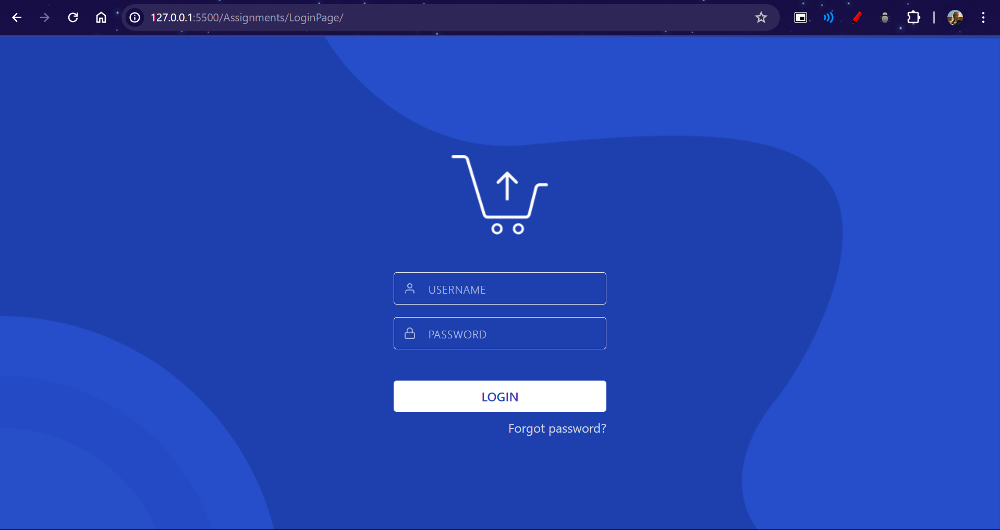
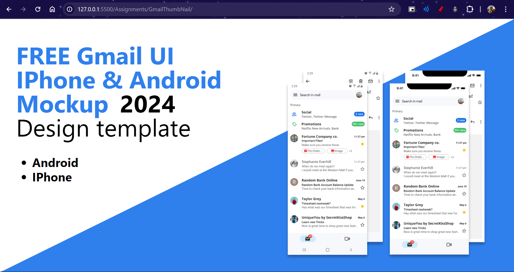
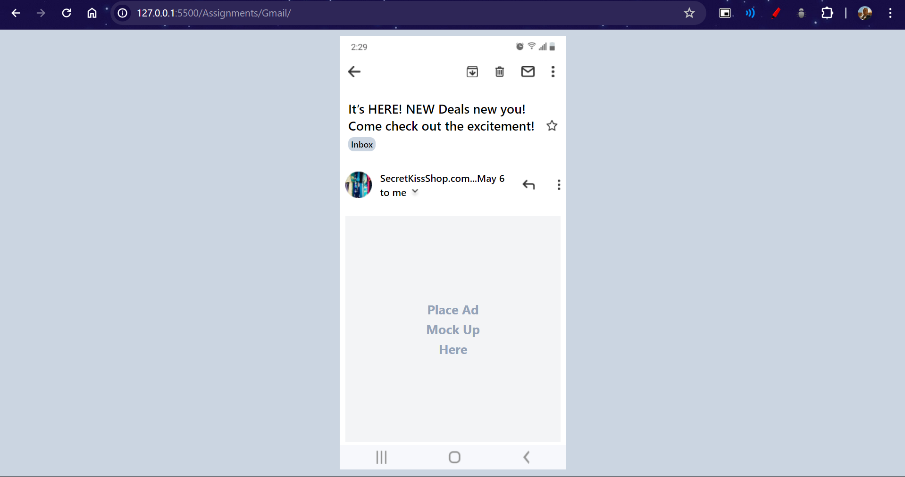

# Figma Design Clones

This project features multiple clones of Figma designs, each implemented using HTML, SCSS, Tailwind, and FontAwesome Icons.

## Clones

1. **Clone 1: [Login Page](<https://www.figma.com/design/RIETxxn8ypeoZdxaq7RAxB/Login-Page-design-(Community)?node-id=0-1&t=Bdo2RpAoUMyQV8Ss-0>)**

   - Technologies Used: HTML, CSS, Tailwind, FontAwesome Icons.
   - [Repository](./Assignments/LoginPage/)

2. **Clone 2: [Gmail UI Thumbnail](<https://www.figma.com/design/RuNyXuiA9h9KNgaJGDambR/Gmail-UI-Mobile-Design-Template-2024!-(Community)?node-id=1-286&m=dev>)**

   - Technologies Used: HTML, CSS, Tailwind, FontAwesome Icons.
   - [Repository](./Assignments/GmailThumbNail/)

3. **Clone 3: [Data Table V3](<https://www.figma.com/proto/kfTMtMFCg1hiXWJdgVaXEx/Data-Table-(Community)?node-id=1376-6447&m=dev&scaling=min-zoom&page-id=73%3A0&starting-point-node-id=1376%3A6447>)**

   - Technologies Used: HTML, CSS, Tailwind, FontAwesome Icons.
   - [Repository](./Assignments/Table/)

4. **Clone 4: [Mobile UI](<https://www.figma.com/design/Di1pHYcmhLonNTOI6VX6HV/Gmail-UI-Mobile-Design-Template-2024!-(Community)?node-id=1-2&t=ohDNzBL0g7XRCqYc-0>)**

   - Technologies Used: HTML, CSS, Tailwind, FontAwesome Icons.
   - [Repository](./Assignments/GmailThumbNail/)

## Screenshots

Here are some screenshots of the project:

    
Login Page

    
Gmail UI Thumbnail

    
Data Table

    
Mobile UI

