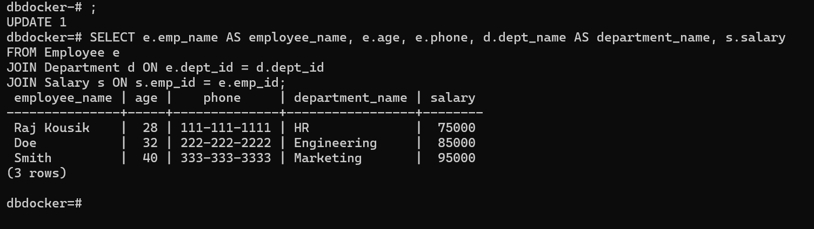

# Day 61

## Work

- Worked on dockerizing the backend SampleApi Project
  You can find the repository [here](./SampleAPISolutioin/)

- Also Worked on dockerizing the frontend Project
  You can find the repository [here](./FrontEndApp/)

## Assignment

## PostgreSQL Docker - Steps to Set Up PostgreSQL Using Docker

### 1. Pull the PostgreSQL Docker Image

```bash
docker pull postgres
```

### 2. Run a PostgreSQL Instance in Docker

```bash
docker run --name postgres_1.0 -e POSTGRES_PASSWORD=password -d postgres
```

Replace `password` with your password

### 3. Create a Database Named `dbDocker`

First, access the running PostgreSQL container:

```bash
docker exec -it postgres_1.0 psql -U postgres
```

Then, create the database:

```sql
CREATE DATABASE dbdocker;
\c dbdocker
```

### 4. Create the Tables with Proper Relationships

```sql
CREATE TABLE Department (
        dept_id SERIAL PRIMARY KEY,
        dept_name VARCHAR(100) NOT NULL
    );

    CREATE TABLE Employee (
        emp_id SERIAL PRIMARY KEY,
        emp_name VARCHAR(100) NOT NULL,
        age INT,
        phone VARCHAR(15),
        dept_id INT REFERENCES Department(dept_id)
    );

    CREATE TABLE Salary (
        emp_id INT PRIMARY KEY,
        salary NUMERIC,
        FOREIGN KEY (emp_id) REFERENCES Employee(emp_id)
    );

```

### 5. Insert Data into the Tables

```sql
    INSERT INTO Department (dept_name) VALUES ('HR'), ('Engineering'), ('Marketing');

    INSERT INTO Employee (emp_name, age, phone, dept_id) VALUES
        ('Raj Kousik', 28, '111-111-1111', 1),
        ('Doe', 32, '222-222-2222', 2),
        ('Smith', 40, '333-333-3333', 3);

    INSERT INTO Salary (emp_id, salary) VALUES
        (1, 75000),
        (2, 85000),
        (3, 95000);
```

### 6. Log Off the PostgreSQL Instance

Exit from the `psql` prompt:

```sql
\q
```

Stop the Docker container:

```bash
docker stop postgres_1.0
```

### 7. Run the Instance Again

Start the Docker container:

```bash
docker start postgres_1.0
```

### 8. Execute a SELECT Query

Access the PostgreSQL container again:

```bash
docker exec -it postgres_1.0 psql -U postgres -d dbdocker
```

Run the SELECT query:

```sql
SELECT e.emp_name AS employee_name, e.age, e.phone, d.dept_name AS department_name, s.salary
FROM Employee e
JOIN Department d ON e.dept_id = d.dept_id
JOIN Salary s ON e.emp_id = s.emp_id;
```

This will print the `employee_name`, `age`, `phone`, `department_name`, and `salary` as required.

### 9. Output

The output of the final select query is given below.


