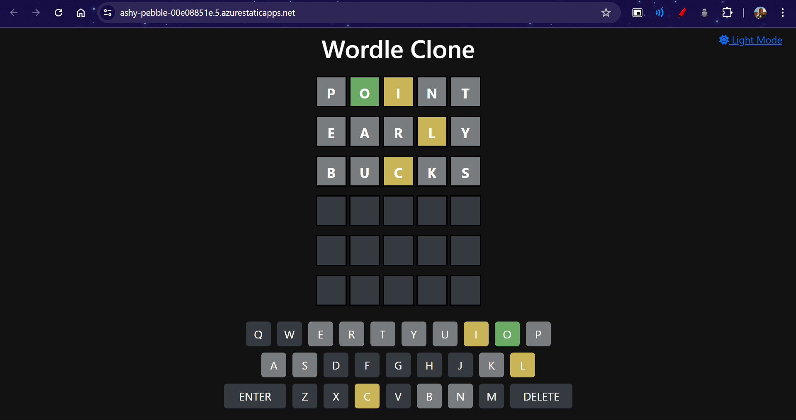
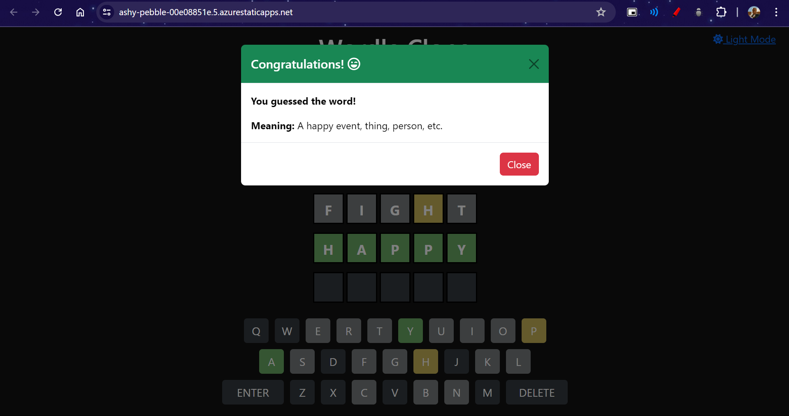
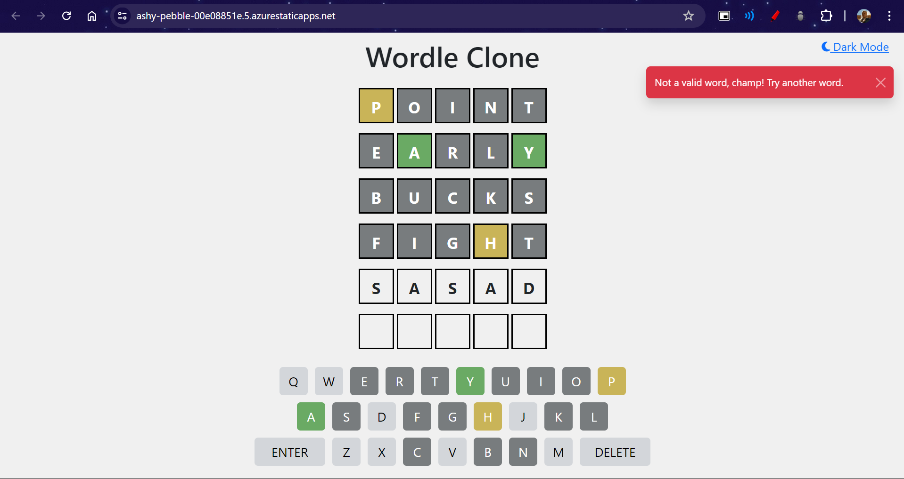
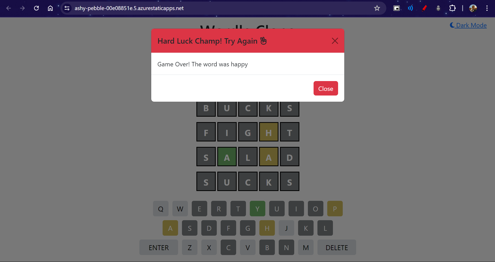

# Day 68 - Wordle Clone

Welcome to the Wordle Clone! This is a simple web-based version of the popular word game Wordle. Test your word-guessing skills and have fun trying to guess the five-letter word of the day!

You can view the live version [here](https://ashy-pebble-00e08851e.5.azurestaticapps.net/).

## Output






## Features

- **Guess the Word**: You have six attempts to guess a five-letter word.
- **Feedback**: Each guess is checked against the correct word and feedback is provided:
  - **Green** for correct letters in the correct position.
  - **Yellow** for correct letters in the wrong position.
  - **Gray** for incorrect letters.
- **Keyboard**: A virtual keyboard is provided for easy input.
- **DarkMode**: Dark Mode / Light Mode Toggle 

## Technologies Used

- **HTML/CSS**: For the basic structure and styling of the game.
- **JavaScript**: For game logic and interactions.
- **Azure Static Web Apps**: Deployed and hosted on Azure for a reliable and scalable web experience.

## Getting Started

### Local Development

1. **Clone the Repository**

   ```bash
   git clone https://github.com/RajKousik/GenSparkTraining/tree/master/Day68%20-%20Jul%2015.git
   ```

2. **Open `index.html` in a Web Browser**

   You can directly open the `index.html` file in a web browser to start playing the game.

### Running the Game

Simply open `index.html` in your preferred web browser to start playing. The game will fetch the list of valid words and allow you to start guessing.

### Deploying to Azure Static Web Apps

The Wordle Clone is hosted on [Azure Static Web Apps](https://azure.microsoft.com/en-us/services/app-service/static/) for easy and scalable deployment.

To deploy your own version:

1. **Create a Static Web App in Azure Portal**
2. **Connect Your GitHub Repository**
3. **Configure Build Settings**
4. **Deploy** the static site using Azure’s deployment options.

## How to Play

Playing the Wordle Clone is simple and fun. Here's how you can get started:

1. **Start a New Game**: Open the game in your web browser. A new game starts automatically.

2. **Make a Guess**: Type a five-letter word using the virtual keyboard or your physical keyboard and submit it as your guess.

3. **Review Feedback**: After each guess, the game will provide feedback for each letter:

   - **Green**: The letter is in the correct position.
   - **Yellow**: The letter is correct but in the wrong position.
   - **Gray**: The letter is not in the word at all.

4. **Use the Feedback**: Use the feedback from your guesses to make better guesses in subsequent attempts.

5. **Winning**: You win the game if you guess the correct word within six attempts.

6. **Losing**: If you fail to guess the word within six attempts, the game will reveal the correct word to you.

7. **Play Again**: After a game ends, whether you win or lose, you can start a new game by refreshing the page.

Enjoy testing your word-guessing skills and have fun playing! Happy guessing!
