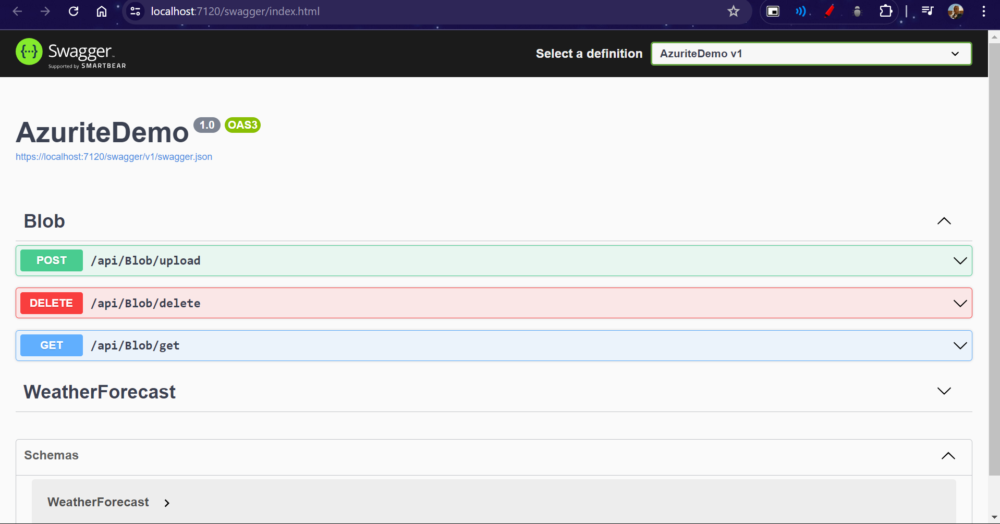
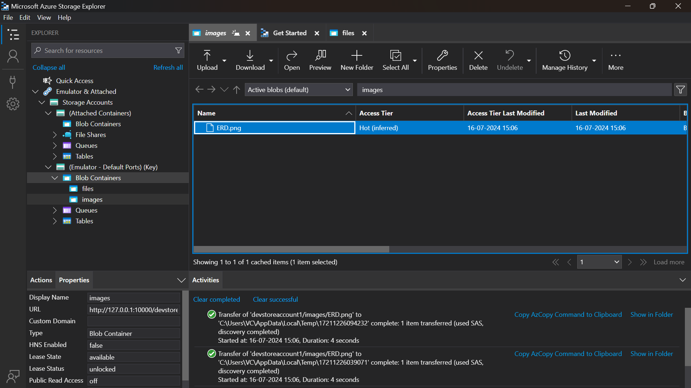
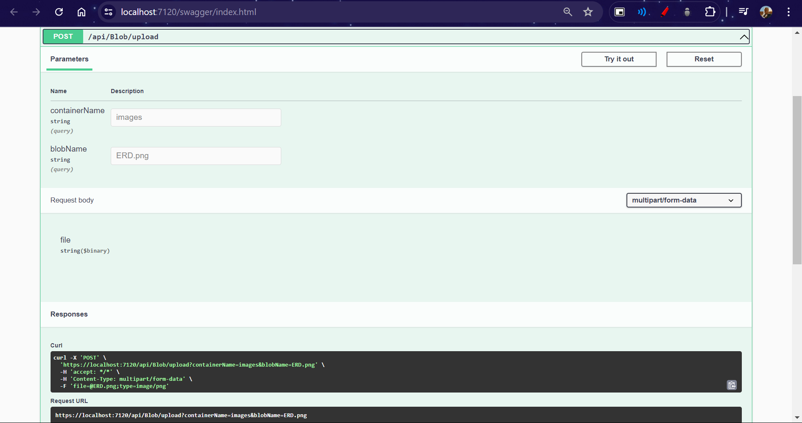
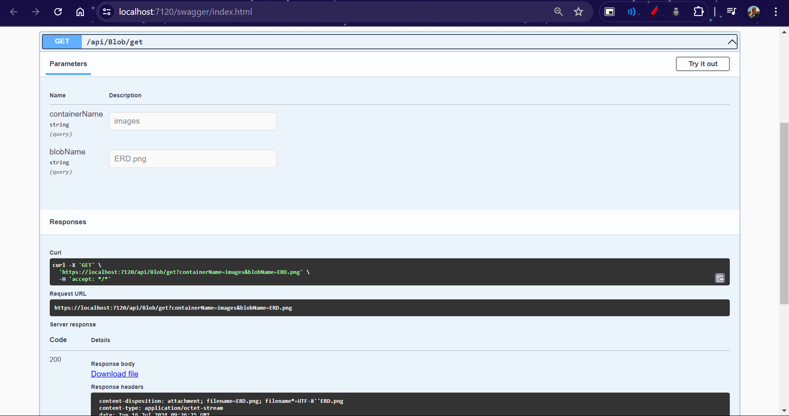

# Day 69

## Topics Covered

- Azure SQL Server
- Storage Container
- Azurite

## Work

### Azure SQL Server

Azure SQL Server is a fully managed relational database service provided by Microsoft Azure. It offers built-in intelligence to support self-management, such as performance tuning and threat alerts. It is scalable, secure, and integrates seamlessly with other Azure services.

### Storage Container in Azure

Azure Storage is a cloud storage solution for modern data storage scenarios. Azure Storage offers highly available, massively scalable, durable, and secure cloud storage. The Azure Storage platform includes the following data services:

**Created a storage container in Azure and worked on databases and tables, which were then deleted.**

- **Blob Storage**: For storing massive amounts of unstructured data.
- **File Storage**: For fully managed file shares in the cloud.
- **Queue Storage**: For message storage between application components.
- **Table Storage**: For NoSQL key-value storage.

**Blob Storage** is specifically used for storing blobs—binary large objects—such as images, videos, and text files. Within Blob Storage, data is organized in containers.

### Azurite

Azurite is an open-source Azure Storage emulator that simulates the Azure Storage Blob, Queue, and Table services for local development purposes. Azurite is compatible with the Azure Storage API, making it an excellent tool for developing and testing your application locally before deploying to Azure.

Find the Azurite work repository [here](./AzuriteDemoSolution/)

#### Features

- Supports Azure Storage Blob, Queue, and Table services.
- Implements the majority of the Azure Storage REST API.
- Provides a local environment to develop and test your Azure Storage applications.

#### Installation and Usage

1. **Install Azurite**:

   ```bash
   npm install -g azurite
   ```

2. **Start Azurite**:

   ```bash
   azurite
   ```

3. **Connection String**:
   Use the following connection string in your application to connect to Azurite:
   ```plaintext
   DefaultEndpointsProtocol=http;AccountName=devstoreaccount1;AccountKey=Eby8vdM02xNOcqFezMO1Kf==;BlobEndpoint=http://127.0.0.1:10000/devstoreaccount1;
   ```

## Screenshots








