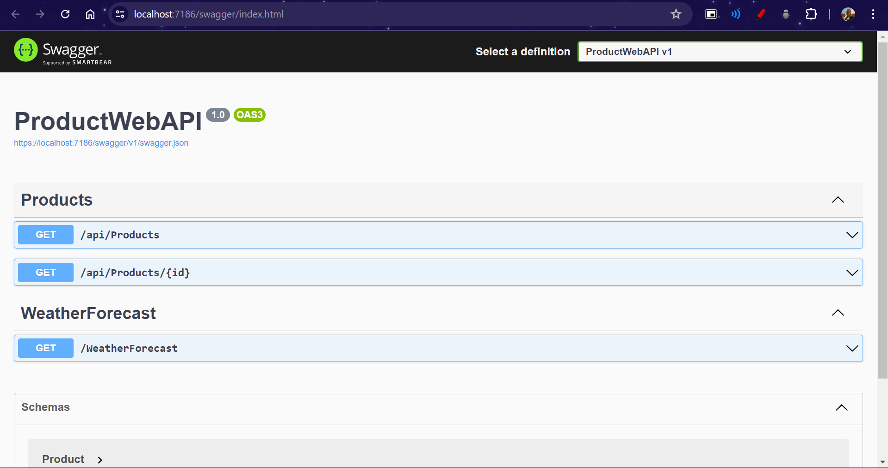
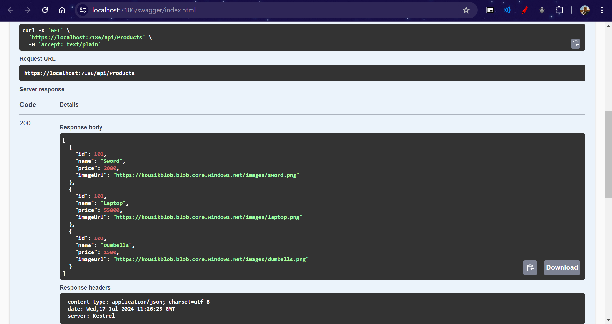
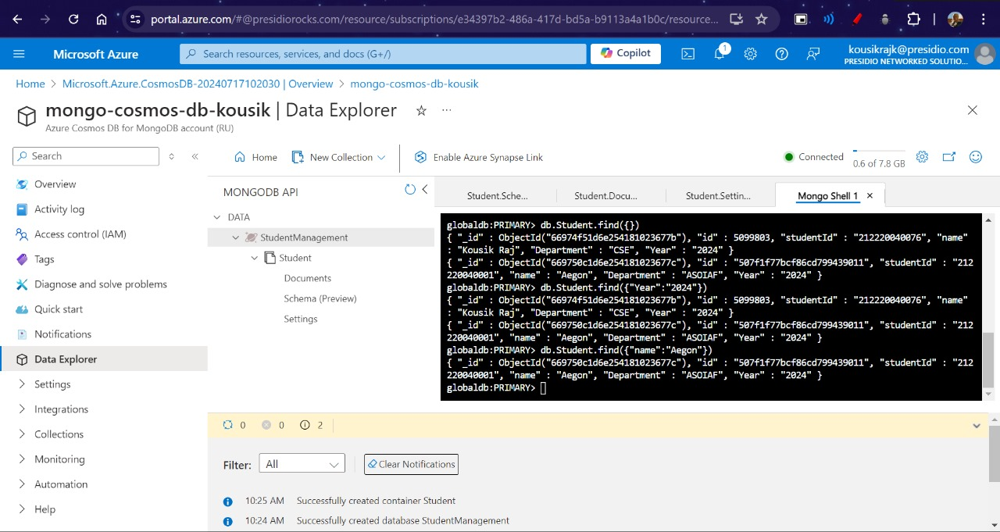

# Day 70 - Product Details Web API

## 1. Product Details Web API

This Web API connects to a SQL Server instance running on a Virtual Machine to fetch product details. It retrieves the product's name, price, and picture. The picture images are stored in Azure Blob Storage, and the connection string for the SQL Server is securely stored and accessed from Azure Key Vault. The API supports only the GET method.

- [Product 1](https://kousikblob.blob.core.windows.net/images/dumbells.png)
- [Product 2](https://kousikblob.blob.core.windows.net/images/sword.png)
- [Product 3](https://kousikblob.blob.core.windows.net/images/laptop.png)

### Features

- **Fetch Product Details**: Retrieve product information including name, price, and a link to the product image.
- **Azure Blob Storage**: Product images are hosted on Azure Blob Storage.
- **Azure Key Vault Integration**: Securely fetch the SQL Server connection string from Azure Key Vault.
- **GET Method**: The API exposes a single GET endpoint to retrieve product details.

### Setup

1. **Clone the Repository**

   ```bash
   git clone https://github.com/your-username/product-details-api.git
   cd product-details-api
   ```

2. **Restore Dependencies**

   ```bash
   dotnet restore
   ```

3. **Configure the Application**

   - **Set Up Environment Variables**:
     Set up the following environment variables with the respective values from your Azure Key Vault and SecretName:

     ```bash
     AZURE_KEY_VAULT_NAME=your-key-vault-name
     AZURE_SECRET_NAME=your-azure-secret-name
     ```

4. **Build and Run the Application**

   ```bash
   dotnet build
   dotnet run
   ```

   The application will be hosted at `http://localhost:7186`.

### API Endpoint

- **GET /api/products**

  Fetches the list of products with their name, price, and image URL.

  **Response**:

  ```json
  [
    {
      "id": 101,
      "name": "Sword",
      "price": 2000.0,
      "imageUrl": "https://kousikblob.blob.core.windows.net/images/sword.png"
    },
    {
      "id": 102,
      "name": "Laptop",
      "price": 55000.0,
      "imageUrl": "https://kousikblob.blob.core.windows.net/images/laptop.png"
    },
    {
      "id": 103,
      "name": "Dumbells",
      "price": 1500.0,
      "imageUrl": "https://kousikblob.blob.core.windows.net/images/dumbells.png"
    }
  ]
  ```

- **GET /api/products/{id}**

  Fetches the product with the given id.

  **Response**:

  ```json
  {
    "id": 102,
    "name": "Laptop",
    "price": 55000.0,
    "imageUrl": "https://kousikblob.blob.core.windows.net/images/laptop.png"
  }
  ```

### Output Screenshots




## 2. Cosmo DB

Connecting to a Mongo CosmoDB in azure and adding databases, tables and few details in the table.


