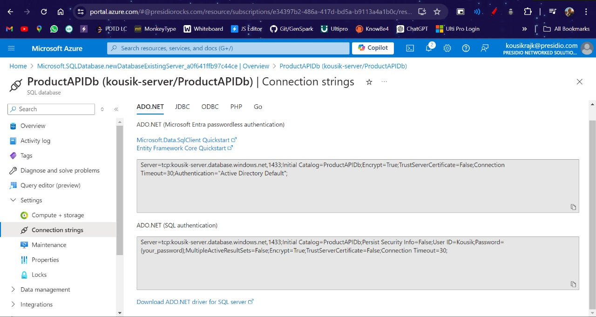
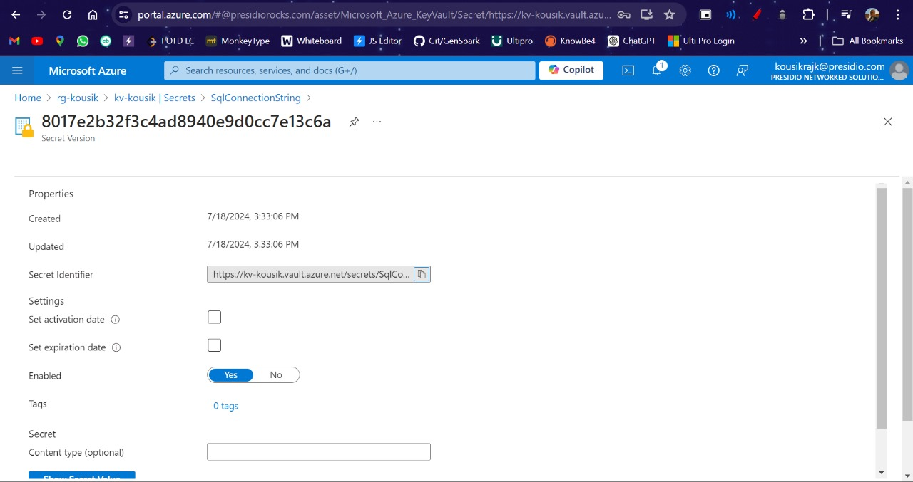

# Day 71

## Topics Covered

- ARM Template
- Created a Azure Storage Account using ARM Template

## Work

1. **Create ARM Template for creating a SQL server**

To create a SQL server using an Azure Resource Manager (ARM) template, you need to include the following key elements:

**Define Parameters**
The template should include parameters for the server name, database name, admin login, and admin password. These allow you to customize the deployment.

**Add SQL Server Resource**
Include a resource section for the SQL server, specifying properties like the version and location. The API version should be set to "2017-10-01-preview" or a later version.

**Add SQL Database Resource**
Include a resource section for the SQL database, specifying the name, location, and SKU. Link the database to the SQL server using the `dependsOn` property.

**Provide Admin Login and Password**
Set the `administratorLogin` and `administratorLoginPassword` properties on the SQL server resource to define the server admin account.

**Customize Other Settings (Optional)**
Optionally, you can add variables, firewall rules, elastic pools, and other configurations to further customize the SQL server and database deployment.

Here is an ARM template snippet that demonstrates the key elements:

```json
{
  "$schema": "https://schema.management.azure.com/schemas/2019-04-01/deploymentTemplate.json#",
  "contentVersion": "1.0.0.0",
  "parameters": {
    "serverName": {
      "type": "string",
      "defaultValue": "[uniqueString('sql', resourceGroup().id)]",
      "metadata": {
        "description": "The name of the SQL logical server."
      }
    },
    "sqlDBName": {
      "type": "string",
      "defaultValue": "SampleDB",
      "metadata": {
        "description": "The name of the SQL Database."
      }
    },
    "administratorLogin": {
      "type": "string",
      "metadata": {
        "description": "The administrator username of the SQL logical server."
      }
    },
    "administratorLoginPassword": {
      "type": "secureString",
      "metadata": {
        "description": "The administrator password of the SQL logical server."
      }
    }
  },
  "resources": [
    {
      "type": "Microsoft.Sql/servers",
      "apiVersion": "2017-10-01-preview",
      "name": "[parameters('serverName')]",
      "location": "[resourceGroup().location]",
      "properties": {
        "administratorLogin": "[parameters('administratorLogin')]",
        "administratorLoginPassword": "[parameters('administratorLoginPassword')]"
      }
    },
    {
      "type": "Microsoft.Sql/servers/databases",
      "apiVersion": "2022-05-01-preview",
      "name": "[format('{0}/{1}', parameters('serverName'), parameters('sqlDBName'))]",
      "location": "[resourceGroup().location]",
      "sku": {
        "name": "S0",
        "tier": "Standard"
      },
      "dependsOn": [
        "[resourceId('Microsoft.Sql/servers', parameters('serverName'))]"
      ]
    }
  ]
}
```

To execute the ARM template and deploy the SQL server and database, the following command is used:

```
az deployment group create \
  --resource-group <your-resource-group-name> \
  --template-file <path-to-your-arm-template-file.json> \
  --parameters \
    serverName=<your-server-name> \
    sqlDBName=<your-database-name> \
    administratorLogin=<your-admin-username> \
    administratorLoginPassword=<your-admin-password>
```

**Screenshots**




2. **Create an ARM Template for creating a Azure vault and add the connection string of SQL in the secret**

To create an Azure Key Vault and add a secret containing the connection string for an Azure SQL database using an ARM template, you can follow these key steps:

**Define Parameters**
Include parameters for the key vault name, secret name, and secret value (the SQL connection string).

**Add Key Vault Resource**
Add a `Microsoft.KeyVault/vaults` resource to the template, specifying the vault name, location, and SKU. Set the `enabledForTemplateDeployment` property to `true` to allow the template deployment to access the vault secrets.

**Add Key Vault Secret Resource**
Add a `Microsoft.KeyVault/vaults/secrets` resource to store the SQL connection string as a secret. Link the secret to the key vault using the `vaultName` property.

**Set the Secret Value**
Use the `value` property on the secret resource to set the secret value to the SQL connection string.

Here is an ARM template snippet that demonstrates these key elements:

```json
{
  "$schema": "https://schema.management.azure.com/schemas/2019-04-01/deploymentTemplate.json#",
  "contentVersion": "1.0.0.0",
  "parameters": {
    "keyVaultName": {
      "type": "string",
      "metadata": {
        "description": "Specifies the name of the key vault."
      }
    },
    "sqlConnectionString": {
      "type": "secureString",
      "metadata": {
        "description": "Specifies the SQL connection string to store as a secret."
      }
    },
    "secretName": {
      "type": "string",
      "metadata": {
        "description": "Specifies the name of the secret in the key vault."
      }
    }
  },
  "resources": [
    {
      "type": "Microsoft.KeyVault/vaults",
      "apiVersion": "2019-09-01",
      "name": "[parameters('keyVaultName')]",
      "location": "[resourceGroup().location]",
      "properties": {
        "enabledForTemplateDeployment": true,
        "tenantId": "[subscription().tenantId]",
        "sku": {
          "name": "standard",
          "family": "A"
        },
        "accessPolicies": []
      }
    },
    {
      "type": "Microsoft.KeyVault/vaults/secrets",
      "apiVersion": "2019-09-01",
      "name": "[format('{0}/{1}', parameters('keyVaultName'), parameters('secretName'))]",
      "properties": {
        "value": "[parameters('sqlConnectionString')]"
      },
      "dependsOn": [
        "[resourceId('Microsoft.KeyVault/vaults', parameters('keyVaultName'))]"
      ]
    }
  ]
}
```

To execute the ARM template and deploy the Azure Key Vault with the SQL connection string secret, the following Azure CLI command is used:

```
az deployment group create \
  --resource-group <your-resource-group-name> \
  --template-file <path-to-your-arm-template-file.json> \
  --parameters \
    keyVaultName=<your-key-vault-name> \
    sqlConnectionString=<your-sql-connection-string> \
    secretName=<your-secret-name>
```

This command will deploy the Azure Key Vault and store the SQL connection string as a secret within the vault, based on the ARM template you provided.

**Screenshots**



